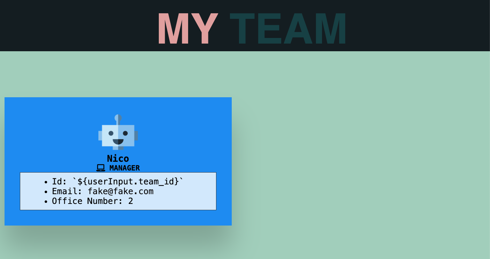

# team-profile-generator
This is a Node.js command-line application that takes in information about employees on a software engineering team and generates an HTML webpage that displays summaries for each person.

## Description

## Installation
### Prerequisites-local machine
This CLI app uses Node.js, you will need to install `nvm`, Node Version manager. This will allow you to install the other packages.
On a Mac, while in your project install 
- `nvm`  
- `node` Node.js version 16
- `npm`  Node Package Manager

## Usage
**Project setup**
- Clone down this repository locally
`git clone git@github.com:westgards/team-profile-generator.git`
- In your project 
  - create `.gitignore` file and add `node_modules/`, `dist`, `.DS_store/` to the file
- Run the following commands in your project terminal
  - `npm init`
  - `npm i inquirer@8.2.4`
  - `npm install`

**Use the below command to run the CLI app locally**

`$node index.js`

## Features
- Node.js CLI tool to generate a HTML webpage that displays user supplied information about a software engineering team 
- Customizable HTML template for more features
- Robust testing to allow for high code maintainability

## Credits

Tutorials:
- [U of MN Coding Bootcamp Link](https://github.com/coding-boot-camp)

